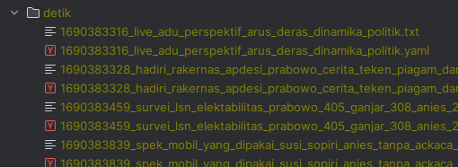
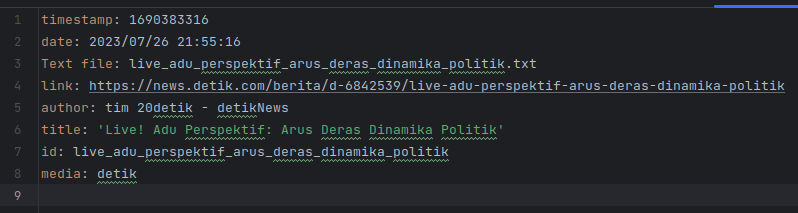
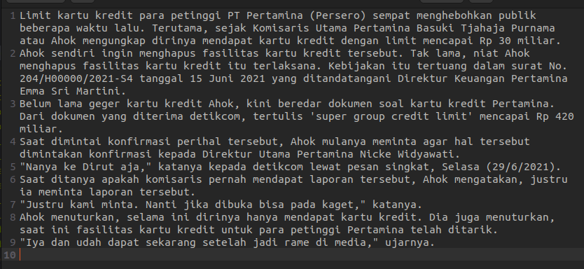

# Scraping News
Welcome to Scraping News v0.6.0

## Features
Scrapper:
- Detik
- Pikiran Rakyat

## Result
### Scrap Result



### Metadata Preview


### Data Preview


## Requirements
- Python 3.10.6
- Pip 22.3.1

## Installation

- Install the requirements of project
```bash
pip install -r requirements.txt 
```

- Run the program
```bash
python main.py
```

or

```
python main.py 2 "technology" 5 tech
```
The 1st argument you can choose between those menu:
1. Detik
2. Pikiran Rakyat

The 2nd argument is the keyword you look after

The 3rd is how many pages you need the data

the 4th argument what folder name you'd like to save the scrap result

## Note
> Feel free to contribute to this open source project
> 
> If you need a new media to added to this project, feel free to
> fork and create a pull request
> 
> But keep in mind, to use [angular commit message convention](https://github.com/angular/angular/blob/main/CONTRIBUTING.md#-commit-message-format)
> before you do pull request 

## Contributors
- Muchlish Choeruddin [Mcx002]